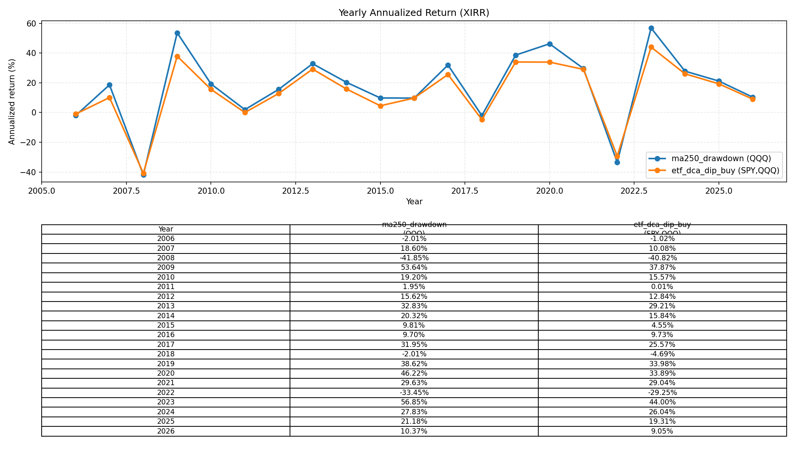
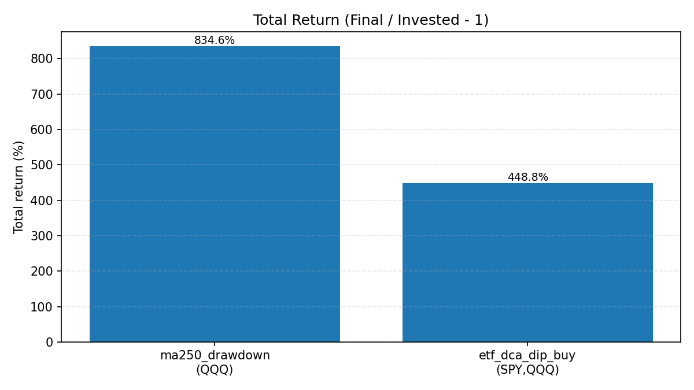
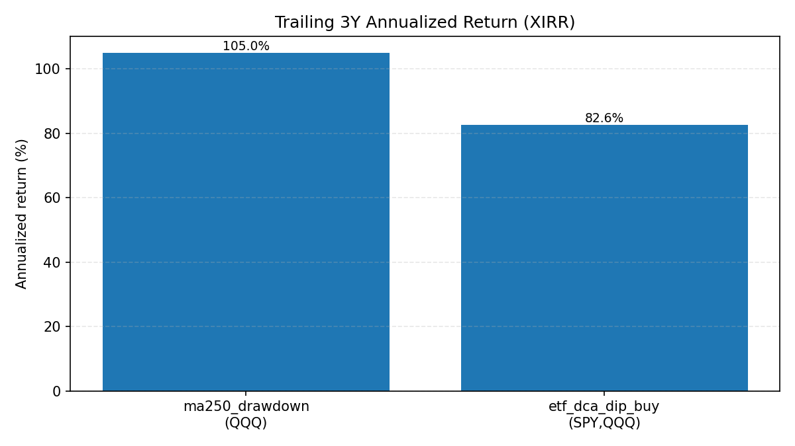

# daily_nasdaq

纳斯达克 ETF（默认 QQQ）定投提醒脚本，支持 PushPlus 微信推送。

## 配置 PushPlus（不上传密钥）

1. 复制示例文件并填写你的 Token：
   - `cp .env.example .env`
   - 编辑 `.env`，设置 `PUSHPLUS_TOKEN=...`
2. `.env` 已在 `.gitignore` 中，不会被提交/上传。

### PushPlus 是什么？为什么需要它？

`PushPlus` 是一个第三方消息推送服务（常用于把脚本/服务器通知推送到微信）。本项目用它来把“本次定投/加仓信号”从本地脚本推送到微信，避免你必须打开终端才能看到结果。

它的作用：
- 把脚本生成的结果（标题 + 内容）通过 PushPlus 的接口发送出去
- 你在微信里就能收到提醒（而不是只在控制台打印）

什么时候会推送？
- 你运行 `python main.py` 时，只要 `.env` 里配置了 `PUSHPLUS_TOKEN`，脚本就会在计算完策略结果后调用推送接口发送一次
- 如果未配置 `PUSHPLUS_TOKEN`（为空），脚本只会在控制台打印，不会推送

## 选择策略

在 `.env` 里设置 `STRATEGY`：

- `STRATEGY=ma250_drawdown`：QQQ 年线（MA250）+ 回撤分档加码（默认）
  - 数据：取 QQQ 近 2 年日线计算 MA250；同时取近 250 个交易日最高点计算回撤
  - 加码规则（从极端到正常依次匹配）：
    - 回撤 ≤ -30%：`5x` 基准定投额
    - 回撤 ≤ -20%：`3x` 基准定投额
    - 跌破 MA250：`2x` 基准定投额
    - 其他：`1x` 正常定投
  - 输出：给出当前价格、MA250、回撤百分比，以及建议买入金额

- `STRATEGY=etf_dca_dip_buy`：VOO+QQQM 每月10号定投 + 下跌分档加仓（近6个月高点回撤 + VIX 条件）
  - 基础定投：每月 10 号（遇到非交易日则顺延到当月第一个交易日）固定投入 `monthly_total_usd`，按权重分配到 VOO/QQQM（默认 50%/50%）
  - 回撤口径：分别以 VOO/QQQM “近 6 个月最高点”计算回撤，取两者中更深的回撤作为触发依据
  - 分档加仓（相对“当月定投总额”的加码比例，满足即触发）：
    - 跌幅 < 8%：不加仓（仅定投）
    - 跌幅 8%–14% 且 VIX>20：加码 20%–30%（当前实现取 25%）
    - 跌幅 ≥ 15%：加码 50%
    - 跌幅 ≥ 25% 且 VIX>25：加码 100%
    - 跌幅 ≥ 35%：动用“年度加仓金池”剩余的 50% 进行加仓（避免一次性耗尽）
  - 年度加仓金池：每年重置为 `annual_reserve_pool_usd`，每次触发加仓会扣减，扣完当年不再额外加仓
  - 输出：列出 VOO/QQQM 当前价、6个月高点、回撤、VIX 以及本次基础定投与额外加仓金额拆分

## 运行

```bash
python main.py
```

如果不配置 `PUSHPLUS_TOKEN`，脚本只会在控制台打印，不发送推送。

## 回测（20年数据 + 近3年年化）

回测脚本在 `backtest/` 下，默认用 `QQQ` 作为纳指100的常用代理，并输出：
- `trailing_3y_xirr`：近3年年化收益（按现金流 IRR/XIRR 计算）
- `full_period_xirr`：全周期年化收益（按现金流 IRR/XIRR 计算）

依赖：

- `pip install yfinance pandas matplotlib`

运行两个策略（分别执行两次）：

- `python -m backtest.run_backtest --strategy ma250_drawdown --symbol QQQ --base-amount 10000 --invest-day 10 --period 20y`
  - 原本的 QQQ 年线（MA250）+ 回撤加码策略
- `python -m backtest.run_backtest --strategy etf_dca_dip_buy --symbols SPY,QQQ --monthly-total 900 --annual-pool 4000 --weights 0.5,0.5 --invest-day 10 --period 20y`
  - VOO+QQQM 的定投+下跌加仓策略（回测默认用 `SPY,QQQ` 代理 `VOO,QQQM`，因为后者历史不足20年）

一次跑完两个策略并生成对比图（输出目录默认 `backtest/`）：

- `python -m backtest.run_backtest --strategy all --symbol QQQ --base-amount 10000 --symbols SPY,QQQ --monthly-total 900 --annual-pool 4000 --weights 0.5,0.5 --invest-day 10 --period 20y --out-dir backtest`

### 展示图

每年年化（XIRR）对比折线 + 表格（图片内含近20年每年单年化）：



总收益率柱状对比：



近三年三年化（XIRR）柱状对比：


