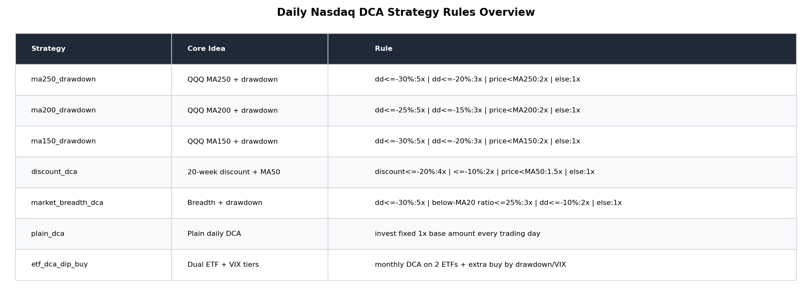

# daily_nasdaq

纳斯达克 ETF（默认 QQQ）定投提醒脚本，支持 PushPlus 微信推送。

## 配置 PushPlus（不上传密钥）

1. 复制示例文件并填写你的 Token：
   - `cp .env.example .env`
   - 编辑 `.env`，设置 `PUSHPLUS_TOKEN=...`
2. `.env` 已在 `.gitignore` 中，不会被提交/上传。

### PushPlus 是什么？为什么需要它？

`PushPlus` 是第三方消息推送服务。本项目用它把“本次定投/加仓信号”推到微信，避免你必须打开终端才能看到结果。

- 运行 `python main.py` 后，如果配置了 `PUSHPLUS_TOKEN`，会自动推送一次
- 如果未配置 token，只在控制台打印

## 策略列表（共 7 种）

在 `.env` 中设置 `STRATEGY=`：

1) `ma250_drawdown`（默认）
- 数据：QQQ 近 2 年日线，MA250 + 近 250 交易日回撤
- 规则：`dd<=-30% -> 5x`；`dd<=-20% -> 3x`；`price<MA250 -> 2x`；否则 `1x`

2) `ma200_drawdown`
- 数据：QQQ 近 2 年日线，MA200 + 近 250 交易日回撤
- 规则：`dd<=-25% -> 5x`；`dd<=-15% -> 3x`；`price<MA200 -> 2x`；否则 `1x`

3) `ma150_drawdown`
- 数据：QQQ 近 2 年日线，MA150 + 近 250 交易日回撤
- 规则：`dd<=-30% -> 5x`；`dd<=-20% -> 3x`；`price<MA150 -> 2x`；否则 `1x`

4) `discount_dca`
- 数据：QQQ 近 1 年日线，近 20 周高点折扣 + MA50
- 规则：`discount<=-20% -> 4x`；`discount<=-10% -> 2x`；`price<MA50 -> 1.5x`；否则 `1x`

5) `market_breadth_dca`
- 数据：QQQ + Nasdaq100 成分股，计算成分股低于 MA20 比例（宽度）
- 规则：`dd<=-30% -> 5x`；`breadth<=25% -> 3x`；`dd<=-10% -> 2x`；否则 `1x`

6) `plain_dca`
- 最普通定投：固定 `1x`，不做择时

7) `etf_dca_dip_buy`
- VOO+QQQM（或回测中 SPY+QQQ 代理）每月定投 + 跌幅/VIX 分档加仓

### 策略规则总览图



## 运行

```bash
python main.py
```

可选环境变量：

- `STRATEGY`：策略名，默认 `ma250_drawdown`
- `SYMBOL`：单标的策略使用的代码，默认 `QQQ`
- `PUSHPLUS_TOKEN`：微信推送 token

## 回测

回测脚本：`backtest/run_backtest.py`

输出核心指标：
- `trailing_3y_xirr`：近 3 年年化收益
- `full_period_xirr`：全周期年化收益

依赖：

```bash
pip install yfinance pandas matplotlib
```

### 单策略回测示例

```bash
python -m backtest.run_backtest --strategy ma200_drawdown --symbol QQQ --base-amount 10000 --invest-day 10 --period 20y
python -m backtest.run_backtest --strategy discount_dca --symbol QQQ --base-amount 10000 --invest-day 10 --period 20y
python -m backtest.run_backtest --strategy market_breadth_dca --symbol QQQ --base-amount 10000 --invest-day 10 --period 20y
python -m backtest.run_backtest --strategy plain_dca --symbol QQQ --base-amount 10000 --period 20y
python -m backtest.run_backtest --strategy etf_dca_dip_buy --symbols SPY,QQQ --monthly-total 900 --annual-pool 4000 --weights 0.5,0.5 --invest-day 10 --period 20y
```

### 一次跑全部策略并出图

```bash
python -m backtest.run_backtest --strategy all --symbol QQQ --base-amount 10000 --symbols SPY,QQQ --monthly-total 900 --annual-pool 4000 --weights 0.5,0.5 --invest-day 10 --period 20y --out-dir backtest
```

会生成：
- `backtest/yearly_xirr_compare.png`
- `backtest/total_return_compare.png`
- `backtest/trailing_3y_xirr_compare.png`

> 注：Yahoo 数据源可能出现限流（`YFRateLimitError`），如遇到可稍后重试。
